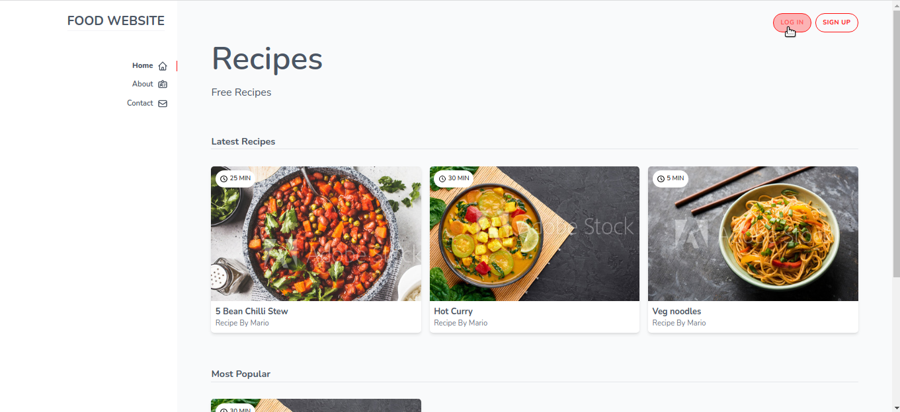
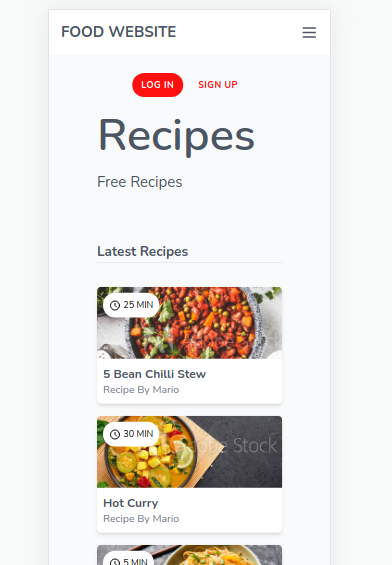

## This is a responsive Homepage design created with tailwindcss

**Based on The Net Ninja tailwindcss course with few edits I made**

#### Here are screenshots for the Desktop/Mobile views:
**Or Check it by yourself: https://food-recipes-website-ui.pages.dev/**

Dektop Version:

Mobile Version:

